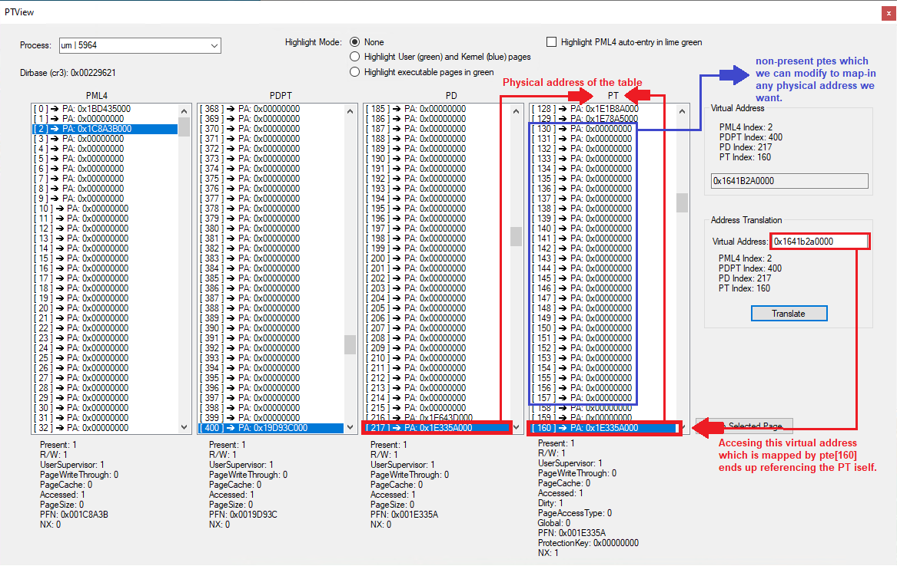

# umpm
A demonstration showcasing how user-mode manipulation of page tables can enable on-demand mapping, bypassing containerization, and granting unrestricted access to arbitrary physical memory.

## Building

1. Clone the repository:
   ```
   git clone https://github.com/Hxnter999/umpm.git
   cd umpm
   ```

2. Create and enter build directory:
   ```
   mkdir build && cd build
   ```

3. Configure and build:
   ```
   cmake -G "Visual Studio 17 2022" ..
   cmake --build . --config Release
   ```

## How it works
- The project is straightforward, it involves modifying page tables to achieve specific mappings. 
- **You need a way of modifying your page tables initially** in whatever way you like. This is **only needed once**. In this case, I'm using a simple kernel driver. 
- Allocate a 4kb buffer in usermode and ask the kernel to modify its mapping to point to the pt itself. Creating a **self referencing pte**.
- Through this pte **the usermode process can access the pt** and modify it's entries to map in any part of physical memory.
- This ensures that everything besides the initial page table modification, is done in usermode and **doesn't require any kernel interaction**.
- For cleanup, we can **simply restore the pfn of the pte we initially modified** to be a self referencing entry, this is also **possible from usermode**. The reason it must be restored is because of the windows vmm which will cause a bigcheck in the case of our illegal mappings.
- Tlb flushes are necessary when modifying page tables but are not possible from usermode. Instead we ask the os to **flush the entries that we modified through `VirtualProtect`** and ensure the cpu never caches it. 

This is how the page tables look after adding the self referencing pte:

*The application you see in the screenshot is [PTView](https://github.com/VollRagm/PTView)*
